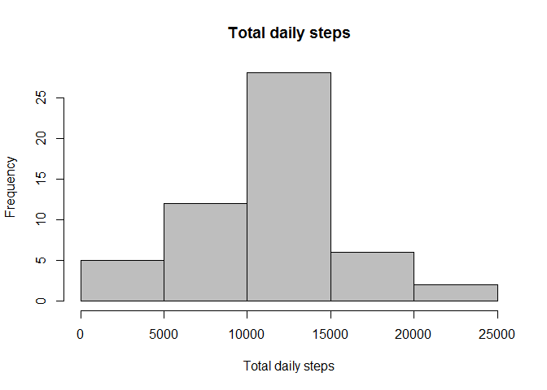
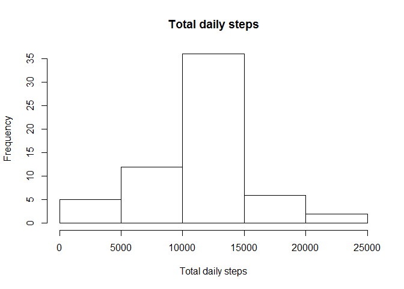
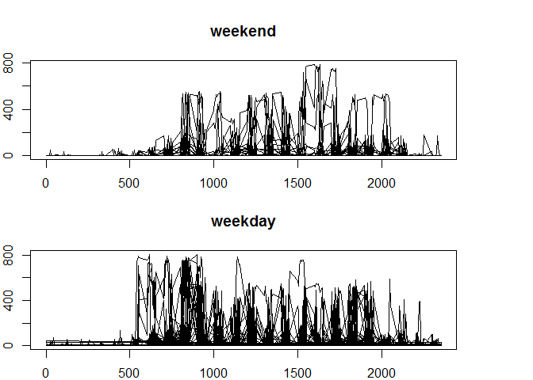

R Markdown
----------

This assignment makes use of data from a personal activity monitoring
device. This device collects data at 5 minute intervals through out the
day. The data consists of two months of data from an anonymous
individual collected during the months of October and November, 2012 and
include the number of steps taken in 5 minute intervals each day.

We will first load the data from file activity.csv, expected to be in
the working directory

    activity <- read.csv("activity.csv", na.strings="NA", sep = "," , stringsAsFactors=FALSE )

Display a histogram of the total number of steps taken per day.
Calculate the daily mean and median of the total

    total <- aggregate(steps~date, activity, FUN="sum", na.action = na.omit)

    hist(total$steps, main = "Total daily steps", xlab = "Total daily steps", col = "gray")

    mean(total$steps)

    ## [1] 10766.19

    median(total$steps)

    ## [1] 10765

PLotting the average daily activity pattern

    meansteps <- aggregate(steps~interval, activity, FUN="mean", na.action = na.omit)
    plot( meansteps$interval,  meansteps$steps, type="l", xlab = "Interval", ylab = "Steps"  )

On average, across all the days in the dataset, the folowing 5 minutes
interval contains the maximum number of steps

    meansteps[meansteps$steps == max(meansteps$steps),] 

    ##     interval    steps
    ## 104      835 206.1698

Imputing missing values: The following is the total number of missing
values in the dataset

    sum(is.na(activity))

    ## [1] 2304

We will replace these values with the average mean for the same time
period

    for(i in seq_len(nrow(activity))) {
        if (is.na(activity$steps[i])){
          activity$steps[i] <-  meansteps[which(meansteps$interval==activity$interval[i]),]$steps[1]
       }
    }

As a result, there is a higher frequency of days around the daily steps
mean

    totalImput <- aggregate(steps~date, activity, FUN="sum")
    hist(totalImput$steps, main = "Total daily steps", xlab = "Total daily steps")

    mean(totalImput$steps)

    ## [1] 10766.19

    median(totalImput$steps)

    ## [1] 10766.19

The two plots below illustrate the differences in activity patterns
between weekdays and weekends

    activity$DayofWeek[weekdays(as.Date(activity$date)) %in% c("Sunday" , "Saturday") ] <- "weekend"
    activity$DayofWeek[ !(weekdays(as.Date(activity$date)) %in% c("Sunday" , "Saturday")) ] <- "weekday"
    activity$DayofWeek <- factor(activity$DayofWeek)

    par(mfrow = c(2, 1), mar=c(2,2,4,5))
    with(subset(activity, activity$DayofWeek == "weekend"), plot(interval, steps, type="l", main = "weekend"))
    with(subset(activity, activity$DayofWeek == "weekday"), plot(interval, steps, type="l",main = "weekday"))

